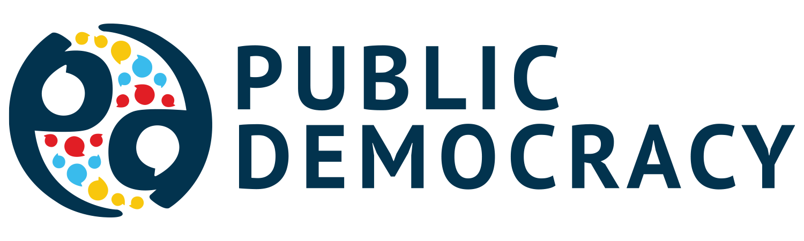

  
  <h1 align="center">🕵️‍♀️ Issues Tracker</h1>

The purpose of this repo is to offer an issue tracker to the PD team and to the PD Tools users.

## How to report an issue or make a feature request
1. Click on this [**LINK**](https://github.com/Public-Democracy/public_issues_tracker/issues) or go to the _**Issues**_ tab of this page
2. Click on create 🟢 **New issue**
3. Add a name and a description:
   - Try to be as specific and clear on the problem you are having or the feature are requesting. You can add images if necessary.
   - 💡**Note**: Stick to ***1 issue*** per feature requested or problem. This makes it a lot easier to track and solve/implement.
     
4. On the Right Panel select the appropiate label and the project:
   - **Labels:** 
      - **☁️ Wordcloud viz** for issues or requests related to the **Word Cloud Generator**
      - **🧠 Ai content writter** for issues or requests related to the **Life Style Content Writter**
      - **🎥 Ai Summary** for issues or requests related to **Online Content Summarizer**
   - **Projects:**
      - Select **PD - Custom Apps**.
        
6. Add labels for the type of Issue or request:
   - 🔵 **enhancement** for feature requests or UI/UX improvements
   - 🔴 **bug** for bugs or errors you are encountering
7. Click post! 👍

Before leaving the page double check that your issue is properly labeled! if you made any mistakes you can always go back and edit it. 

_**P.D:** if you have made posted an Issue in the past you can always comeback and check the status of your **feature request** or **problem**._
